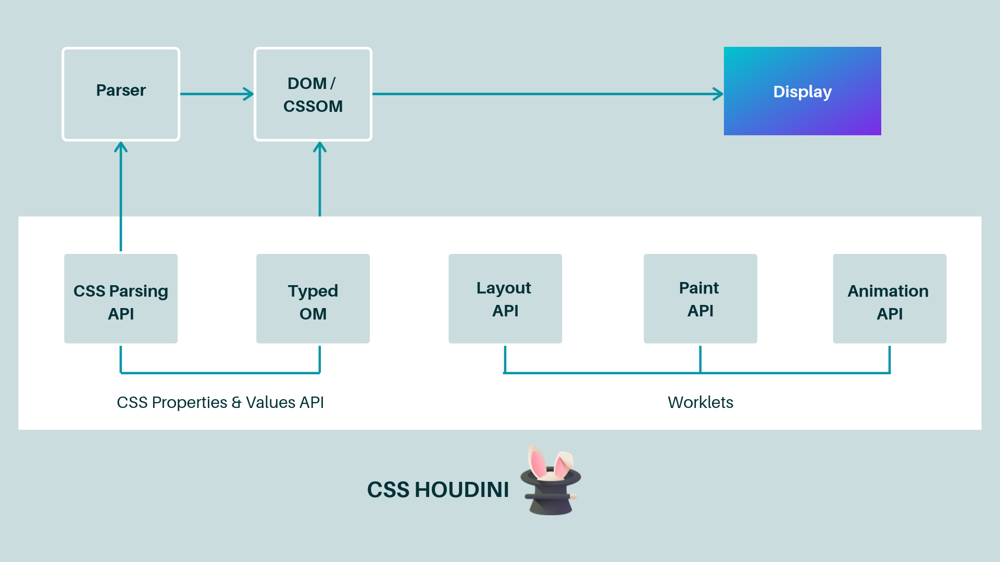

# Houdini

CSS Houdini 是一组底层 API，它们公开了 CSS 引擎的各个部分，从而使开发者可以通过这组 API 来扩展 CSS。它让开发者拥有了直接访问 CSSOM 的能力，开发者可以通过这组 API 来编写浏览器可解析的 CSS 代码，这让开发者可以在不需要等待浏览器的实现的前提下实现自己想要的 CSS 功能。

1. Typed OM API
2. Properties & Values API
3. Paint API
4. Layout API
5. Animation worklet
6. Parser API
7. Font Metrics API

## CSS Paint API

🌰: 随机颜色

## CSS Typed Object Model

- [更高效、更安全地操作 CSSOM ：CSS Typed OM](https://juejin.im/post/5bc712245188255c352d8c5a)
- [Working with the new CSS Typed Object Model](https://developers.google.com/web/updates/2018/03/cssom)

