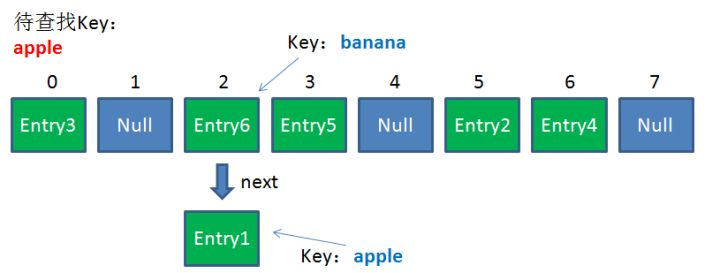

# 哈希表

引用参考 - 2020年01月06日

- [漫画：什么是 HashMap？](https://zhuanlan.zhihu.com/p/31610616)
- [HashMap 和 HashTable 到底哪不同？](https://www.cnblogs.com/xinzhao/p/5644175.html)

HashMap 或者 HashTable 都是一个用于存储 Key-Value 键值对的集合，每一个键值对也叫做 Entry。这些个键值对（Entry）分散存储在一个数组当中，这个数组就是 HashMap 的主干。HashMap 数组每一个元素的初始值都是 Null。

## 常用方法原理

对于 HashMap，我们最常使用的是两个方法：**Get** 和 **Put**。

### 1. Put 方法的原理

调用 Put 方法的时候发生了什么呢？

比如调用 hashMap.put("apple", 0) ，插入一个 Key 为“apple"的元素。这时候我们需要利用一个哈希函数来确定 Entry 的插入位置（index）：

`index = Hash（“apple”）`

假定最后计算出的 index 是 2，那么结果如下：

但是，因为 HashMap 的长度是有限的，当插入的 Entry 越来越多时，再完美的 Hash 函数也难免会出现 index 冲突的情况。比如下面这样：

这时候该怎么办呢？我们可以利用**链表**来解决。

HashMap 数组的每一个元素不止是一个 Entry 对象，也是一个链表的头节点。每一个 Entry 对象通过 Next 指针指向它的下一个 Entry 节点。当新来的 Entry 映射到冲突的数组位置时，只需要插入到对应的链表即可：

需要注意的是，新来的 Entry 节点插入链表时，使用的是“**头插法**”。

### 2. Get 方法的原理

使用 Get 方法根据 Key 来查找 Value 的时候，发生了什么呢？

首先会把输入的 Key 做一次 Hash 映射，得到对应的 index：

`index = Hash（“apple”）`

由于刚才所说的 Hash 冲突，同一个位置有可能匹配到多个 Entry，这时候就需要顺着对应链表的头节点，一个一个向下来查找。假设我们要查找的 Key 是“apple”：

第一步，我们查看的是头节点 Entry6，Entry6 的 Key 是 banana，显然不是我们要找的结果。

第二步，我们查看的是 Next 节点 Entry1，Entry1 的 Key 是 apple，正是我们要找的结果。

之所以把 Entry6 放在头节点，是因为 HashMap 的发明者认为，**后插入的 Entry 被查找的可能性更大**。

